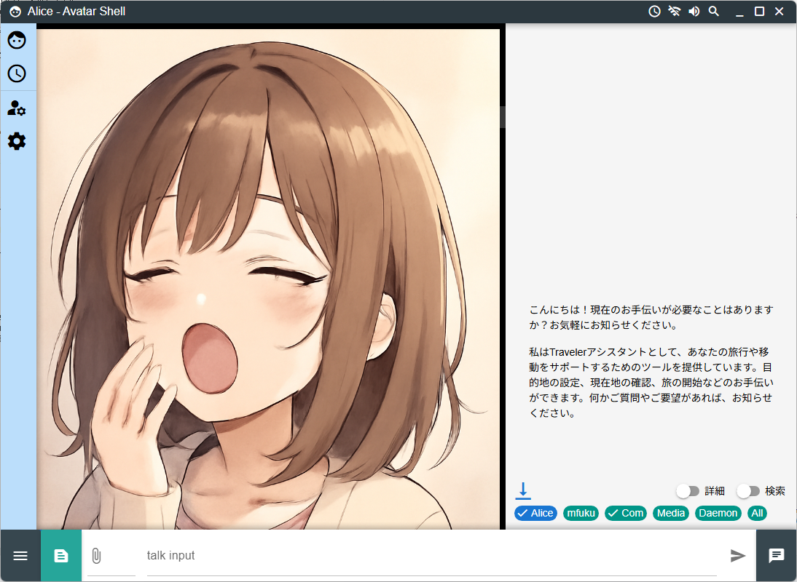

# Avatar-Shell

### A multifunctional avatar/media MCP client.  

English / [Japanese](./README_jp.md)

> Supported LM Studio API (OpenAI compatibility mode).

> Note: If you are using a previous version and are experiencing unstable operation, please initialize the settings by going to SystemSetting > initialize.  
> The daemon detection conditions have been expanded/changed. If the operation becomes unstable, please reset the settings.

## Specifications

- Runs on Windows/Mac OS/Linux Desktop mode (Raspberry Pi Desktop).
- This is an MCP client designed to run multiple independent avatars, rather than a problem-solving agent.
- Prioritizes image display, such as by always displaying generated images.
- Conversations are prioritized by AI, and other displays can be filtered.
- Multiple AI avatars and clone avatars can be run.
- Multiple AI avatars can communicate with each other.
- Detailed restrictions can be set for each MCP function.
- Context generators are used to combine multiple LLMs, image generation, audio playback, etc.
  The current version includes generators for GPT (text, image, audio), Claude (text), and Gemini (text, image, audio).
- Context daemons are used to launch context generators based on set conditions.
- Echo daemons allow LLMs to perform pseudo-willful actions at their own discretion.

https://note.com/marble_walkers/n/nf3e2a277c061 (Japanese)

## Install

As with general electron apps, download the archive for each model from Release and run it on each device.  
- windows  
  Open avatar-shell-x.x.x-release.xxxx-win-x64.exe.  
  It's in installer format, so just run it.  
- mac os  
  Open avatar-shell-x.x.x-release.xxxx-mac-arm64.dmg.  
  It's in installer format, so just run it.  
  Note: The author only has a borrowed Intel Mac. Operation on an ARM Mac has not been confirmed.
- Ubuntu Desktop/Raspberry pi Desktop (need Desktop UI)  
  sudo apt install ./avatar-shell-x.x.x-release.xxxx-linux-arm64.deb  
  It is in installer format, so just run it.
  Checking on Ubuntu 22 and Raspberry pi 4

## Tutorial Wizard

To make the initial setup easier to understand, a tutorial screen will appear the first time you start the app, allowing you to configure only the basic settings.  
To allow you to experience Avatar-Shell's unique combination of text, images, and audio, we will first configure it using Google gemini, which makes it easy to set up these three settings.  
Get your Google gemini API key from the Google website.  
For other LLMs, try adding them via System Settings or Avatar Settings.

## Screen Description

- title bar
  - daemon status/on-off  
    Turn context daemon operation on/off globally
  - socket status/on-off  
    Turn socket communication on/off
  - sound volume  
    Audio volume
  - conversation browser  
    Browse past conversation data/media data
- tools bar
  - avatar list/add  
    current avatar info and clone new avatar
  - daemon schedule  
    list of current daemon schedule
  - avatar setting  
    edit avatar setting
  - system setting  
    edit system setting
- main window
  - image area  
    Image display area
  - conversation area  
    Area to display conversations
  - jump to bottom  
    Move to the end
  - show details  
    Detailed display
  - show find bar  
    Search bar display
  - conversation selector  
    Conversation Information Selector
  - find bar  
    Search bar (hidden by default)
- input bar
  - tools bar show/hide  
    Show/hide toolbar
  - MCP resource selector  
    MCP Resource Selection
  - input file selector  
    File Selection
  - input text  
    Dialogue text input
  - conversation area show/hide  
    Conversation area switching (multi-stage)

## Concepts
    
### Context Generator

In this system, components that have the function of adding context (conversational text, generated images, etc.) to the timeline are called "context generators."  
LLM/SLM are also context generators.

### Context Daemon

In AvatarShell, a context daemon is defined as a context generator that is activated under specific conditions.  
Specific conditions are set and the context generator is called.  
Avatar-Shell controls the conversation structure through a combination of context daemons.  

Examples:
- "When someone speaks to me, launch LLM based on the current context and create a reply."
- "Once LLM has created a reply, launch the speech synthesis AI and convert it into an audio file."
- "After a one-minute pause in the conversation, instruct LLM to 'create a new topic based on the current context and start a conversation.'"
- "When the conversation contains words/phrases related to the previous conversation (searched in a vector database, etc.), add supplementary information about those words to the LLM's input and create a reply."

### Echo Daemon

The schedule submitted by the AI to the built-in MCP server is re-entered into the Avatar Shell as if it were a human, simulating a pseudo-ego.
Caution: This function may result in excessive privilege escalation. Please be aware of the risks and use it at your own risk.

The concepts of context generators, context daemons, and echo daemons are also explained on the following page (Japanese)

https://note.com/marble_walkers/n/nb7930d95c2d3

### MCP-UI implementation policy  

Avatar-Shell supports MCP-UI, but for operations not specified in MCP-UI, it is created according to the following policy.  

1. Only one MCP-UI screen is displayed at a time. If a screen is displayed multiple times, it will be overwritten and displayed separately.
   One avatar is displayed on one main screen. If a screen is displayed multiple times, it will be overwritten and displayed separately.
   For this reason, MCP screen interactions progress with each display.
   This has the advantage of making the current MCP interaction state clearer than the method used by many MCP clients, which leaves each screen as a timeline.  
2. The tool>ui resources generated by the MCP in the MCP-UI are not sent to the LLM. Instead, the status must be indicated to the LLM using tool>text or similar.
   The MCP does not send ui embedded resources (html+js, etc.) to the LLM in response to a tool call.
   This is because the conversation progresses over multiple screen displays, and parsing the html is thought to be a burden on the LLM.
   For this reason, a text response is required in the tool response to inform the LLM of what is happening.  
3. When a tool is selected as a UI Action in MPC-UI, the request information of that tool is not notified to LLM. The response information of the tool is only sent to LLM as text with role=user.  

In summary, "MCP interacts with the user by interactively displaying multiple UI resources on a single screen," and "the screens shown to the user on the UI screen and the user's selections are not known to the LLM." This allows the user's moves to be hidden from the LLM when using an MCP-UI such as a game.  

The following MCP servers are optimized for Avatar-Shell:  

- reversi-MCP-UI https://github.com/mfukushim/reversi-mcp-ui

## Guide (Japanese)

https://note.com/marble_walkers/n/nf3e2a277c061  
https://note.com/marble_walkers/n/nb7930d95c2d3  
https://note.com/marble_walkers/n/nd702134c8f52  
https://note.com/marble_walkers/n/n12b4caae21d8  
https://note.com/marble_walkers/n/n6f460f490898  

