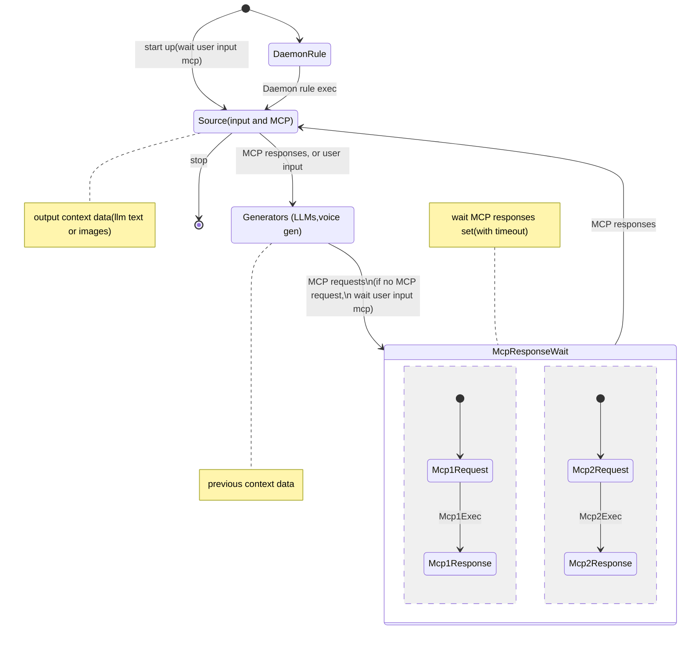
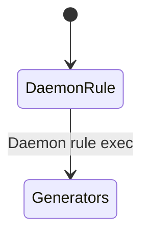
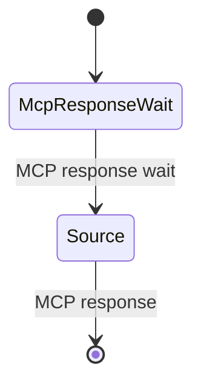

```mermaid

stateDiagram-v2
  Source: Source(input and MCP)
  Generators: Generators (LLMs,voice gen)

  [*] --> Source:start up(wait user input mcp)
  [*] --> DaemonRule
  DaemonRule --> Source: Daemon rule exec
  note right of Generators
    previous context data
  end note
  Source --> Generators: MCP responses, or user input
  Generators-->McpResponseWait: MCP requests\n(if no MCP request,\n wait user input mcp)
  note right of Source
    output context data(llm text or images)
  end note
  state McpResponseWait {
    [*] --> Mcp1Request
    Mcp1Request --> Mcp1Response : Mcp1Exec
    --
    [*] --> Mcp2Request
    Mcp2Request --> Mcp2Response : Mcp2Exec
  }
  McpResponseWait --> Source: MCP responses
  note left of McpResponseWait
    wait MCP responses set(with timeout)
  end note
  Source-->[*]: stop


```

```mermaid
stateDiagram-v2
  [*] --> DaemonRule
  DaemonRule --> Generators: Daemon rule exec

```

```mermaid
stateDiagram-v2
  [*] --> McpResponseWait
  McpResponseWait --> Source: MCP response wait
  Source --> [*]: MCP response

```

user input待ちには

userのテキストエンター
userのファイルアップロード

MCP-UIなどのintent(状態変化をLLMに依頼する),notify(状態変化の報告のみ),toolの実行結果 なども含む

もuser inputであり、これらはスプール可能(またはスプール禁止)が可能に作るべき。
